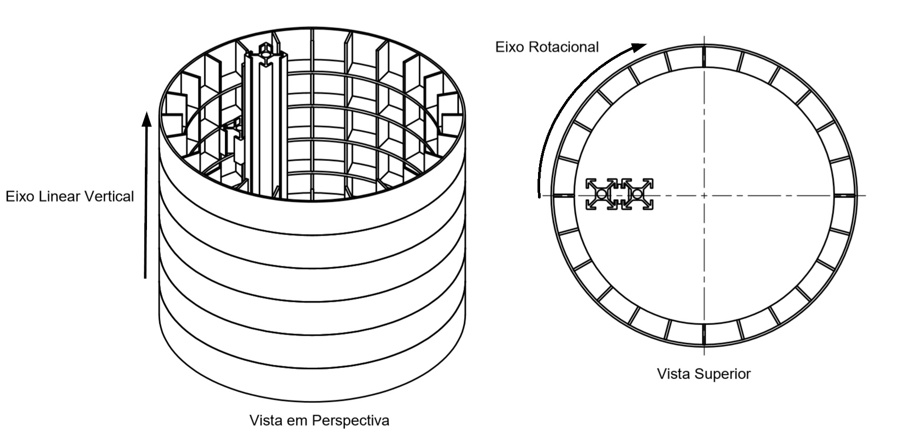

# TCCCapsuleDispenser

### OBS: This is not a code repo

<!-- PROJECT LOGO -->
 

  

  <h3 align="center">DISPENSADOR DE REMÉDIOS PARA O AUXÍLIO DE TERAPIASMEDICAMENTOSAS</h3>

  

    My Undergraduate thesis
     
    <a href="https://github.com/luanrem/TCCCapsuleDispenser/tree/master/Document"><strong>Explore the PDF »</strong></a>
     
     
    <a href="https://github.com/luanrem/TCCCapsuleDispenser/tree/master/GitHubFiles">View Images</a>
    ·
    <a href="https://github.com/luanrem/TCCCapsuleDispenser/tree/master/Arquivos%20Refer%C3%AAncias">View Reference files</a>
    .
    <a href="https://github.com/luanrem/TCCCapsuleDispenser/tree/master/Montagens">View mounts</a>
  

<!-- ABOUT THE PROJECT -->
## About The Project

The concern of doctors about the effectiveness of drug treatments is increasing over the years. Whether due to carelessness, cognitive difficulties, memory or poor administration of medication, patients who do not follow the prescription make it difficult to treat diseases and can generate both personal and public health costs. A significant portion of the time for doctor or nurse visits is spent reviewing drug information and how it should be taken. 

The motivation of the project is the increase in the elderly population in Brazil and the average increase in the number of medicines used by patients. The aim of this paper is to present a possible medical automation solution to the problem of patient maladministration of pills, the development of a drug dispenser that supports the pills and assists those unable to properly administer the prescription. The development of the work was to cover the application for elderly patients, or who have cognitive difficulties, or difficulty reading the prescriptions and need help in administering their medications. 

We used 2 free softwares, the [Fusion 360](https://www.autodesk.com.br/collections/product-design-manufacturing/fusion-360?plc=PDCOLL&term=1-YEAR&support=ADVANCED&quantity=1) for the assembly of the mechanical structure of the dispenser and the tests before the prototype manufacture and the [Easy EDA](https://easyeda.com/) for the development of the electronic circuit and the layout of the printed circuit board. With the C-language Arduino microprocessor setup code, from microprocessor automation, motors, and devices that aid product operation, the setup resembles a cell phone alarm setup, and device power is simplified to facilitate its use. The result is a functional prototype that allows alarm configurations and will meet the needs of several patients.

<!-- USAGE EXAMPLES -->
## How it works

[![Product Name Screen Shot][product-screenshot]](https://example.com)

Basically it is a dispenser with two axes, one rotating, or horizontal, and one vertical. The medicine is placed in small compartments inside the horizontal axis. These compartments are spaces that store medication. When it is time for this medication to be taken, the vertical axis will move to the place where the stem will lift the compartment door vertically. This way the medicine falls to the bottom and can be taken.

<!-- CONTACT -->
## Contact

Luan Roberto Estrada Martins - [Linkedin](https://br.linkedin.com/in/luanrem) - luanrem@gmail.com

Project Link: [https://github.com/luanrem/TCCCapsuleDispenser](https://github.com/luanrem/TCCCapsuleDispenser)

<!-- MARKDOWN LINKS & IMAGES -->
<!-- https://www.markdownguide.org/basic-syntax/#reference-style-links -->
[product-screenshot]: GitHubFiles/function.gif